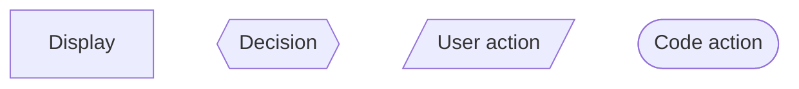
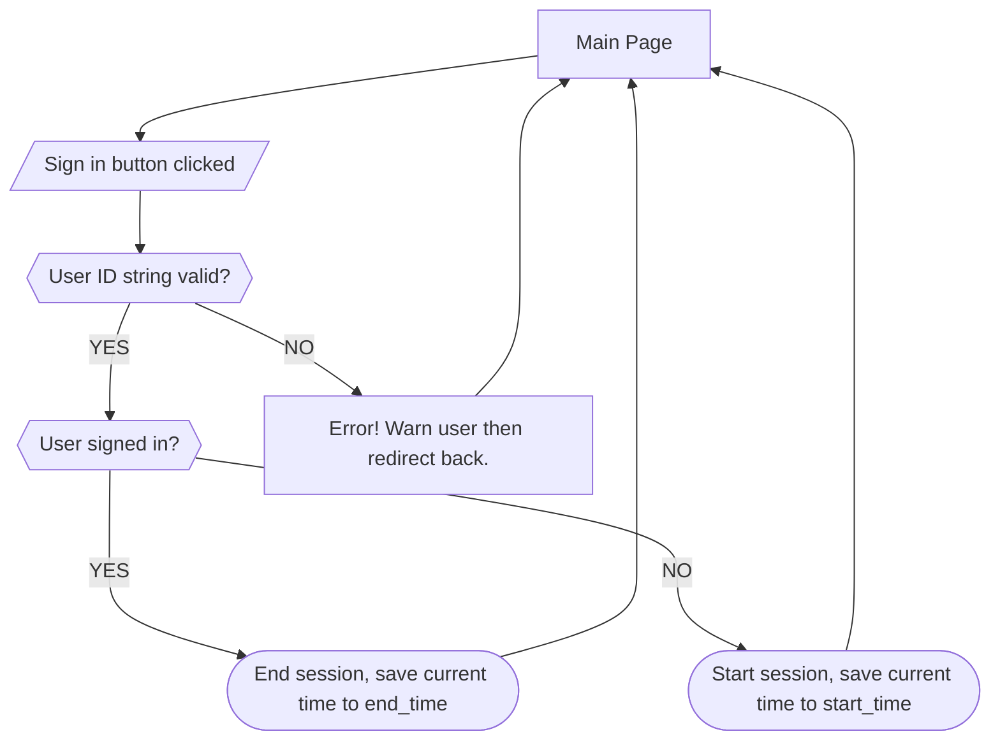

## DB Schema
```mermaid
erDiagram
    USER ||--o{ TIME_SESSION : has
    USER {
        int id PK
        string name
        string id_string
    }
    TIME_SESSION {
        int id PK
        int user_id FK
        string start_time
        string start_time
    }
 ```
# Classes
```mermaid
classDiagram
    class User {
        name: string
        id_string: string
    }
    class TimeSession {
        user_id: int
        start_time: datetime
        end_time: datetime
        total_time: timedelta
    }
```
## UI flow key

## Sign-In/Out UI Flow

